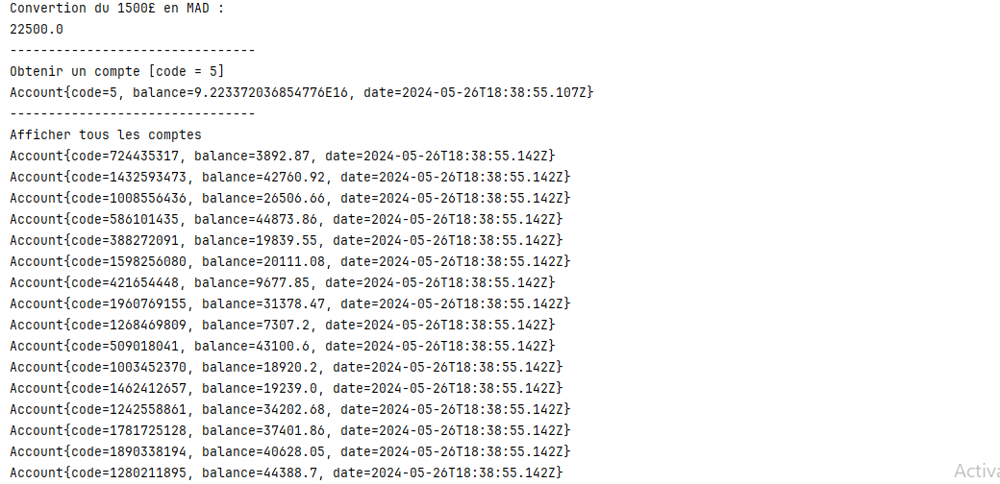

# Compte rendu de l'application cliente SOAP 

Ce document présente l'application cliente développée en Java pour interagir avec le service web SOAP "MicroBank".

## Architecture de l'application cliente

L'application cliente utilise le proxy généré par IntelliJ pour accéder aux méthodes du service web. Le proxy contient les interfaces et les classes nécessaires pour la communication avec le service.

* **Proxy:**
    * `BankWS`: interface définissant les méthodes du service web.
    * `MicroBankService`: classe permettant d'instancier le proxy du service web.
    * `Account`: classe représentant un compte bancaire.

* **Client:**
    * `BankWSClient`: classe principale de l'application client.

## Implémentation de l'application cliente

**Code de l'application cliente `BankWSClient`:**

```java
package ma.amarghad;

import ma.amarghad.proxy.Account;
import ma.amarghad.proxy.BankWS;
import ma.amarghad.proxy.MicroBankService;

import java.util.Scanner;

public class BankWSClient {
    public static void main(String[] args) {
        BankWS bankWS = new MicroBankService().getBankWSPort();
        System.out.println("Convertion du 1500£ en MAD :");
        System.out.println(bankWS.toMAD(1500));

        System.out.println("--------------------------------");
        System.out.println("Obtenir un compte [code = 5]");
        printAccount(bankWS.getAccount(5));

        System.out.println("--------------------------------");
        System.out.println("Afficher tous les comptes");
        bankWS.getAccounts().forEach(BankWSClient::printAccount);

    }

    public static void printAccount(Account account) {
        String accountStr = "Account{" +
                "code=" + account.getCode() +
                ", balance=" + account.getBalance() +
                ", date=" + account.getDate() +
                '}';

        System.out.println(accountStr);
    }
}
```

## Exécution de l'application cliente

L'application cliente utilise le proxy généré par IntelliJ pour appeler les méthodes du service web. Elle effectue les opérations suivantes:

* Convertit un montant en euros en dirhams marocains.
* Récupère un compte bancaire en fonction de son code.
* Affiche une liste de comptes bancaires.



## Conclusion

L'application cliente SOAP fonctionne correctement et permet d'interagir avec le service web "MicroBank" en utilisant le proxy généré par IntelliJ. Elle illustre l'utilisation de la technologie SOAP pour la communication entre applications.